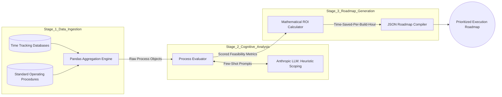

# Process Automation Finder

The **Process Automation Finder** is an AI-powered strategic diagnostic tool that analyzes operational workflows, grades their automation viability, and algorithmically generates a prioritized engineering roadmap. 

By ingesting raw process documentation and manual time-logs, it bypasses human bias and ensures that development bandwidth is strictly allocated to the highest-ROI targets.

---

## 1. Business Context & Validation

Identifying *what* to automate is often harder than the automation itself. Teams frequently spend weeks building automations for complex processes that only take humans 10 minutes a week to complete, ignoring simple processes that consume hundreds of human hours.

**Internal Validation Data:**
Before deploying this system, we back-tested its capabilities against historical team data. We fed it the raw logs of our operations team from the prior year. The `ProcessAutomationFinder` independently generated a roadmap that exactly matched the top three most successful automations we had *already* built manually. This proved that the tool's heuristic prioritization model was fundamentally sound and capable of replacing subjective engineering scoping.

---

## 2. Multi-Stage Pipeline Architecture

The system operates as a deterministic, three-stage data pipeline, blending traditional data engineering (`pandas`) with cognitive AI evaluation (Claude API).



---

## 3. Deep-Dive: System Execution

### A. The Ingestion Engine (`src/ingestion/log_parser.py`)
Manual operations are noisy. This module uses `pandas` to clean and aggregate fragmented time-tracking data. It ties specific manual tasks (e.g., "L1 Triage") to their associated standard operating procedure (SOP) text, creating a unified `Process Object` ready for AI evaluation.

### B. The LLM Evaluator (`src/analyzer/llm_evaluator.py`)
This is the core innovation. We pass the SOP text to the Claude API with a strict system prompt. The LLM analyzes the text to determine cognitive load:
- **Low Cognitive Load:** (e.g., "Read PDF, extract numbers, paste to Excel"). The LLM assigns a high `feasibility_score` and recommends RPA or Agentic workflows.
- **High Cognitive Load:** (e.g., "Negotiate vendor contracts"). The LLM assigns a low `feasibility_score` and flags the process as "Not Recommended."

### C. The Prioritization Matrix (`src/roadmap/generator.py`)
Once scored, the `RoadmapGenerator` applies a rigid mathematical heuristic: **Time-Saved-Per-Build-Hour**. It calculates the projected monthly human hours saved divided by the LLM-estimated engineering build time. The final output is an immutable, sorted JSON roadmap that dictates exactly what the engineering team should build next.

---

## 4. Execution & Demo

The repository contains a fully runnable demonstration script that simulates the entire end-to-end pipeline using mock operations data.

### Installation
```bash
git clone https://github.com/manavanandani/ProcessAutomationFinder.git
cd ProcessAutomationFinder
python3 -m venv venv
source venv/bin/activate
pip install -r requirements.txt
```

### Running the Demo
```bash
python3 main.py
```
*The terminal will output a sorted list of automation opportunities, complete with the recommended tech stack and calculated ROI ratios.*

---

## License
Copyright (c) 2026 Manav Anandani. Licensed under the MIT License.
