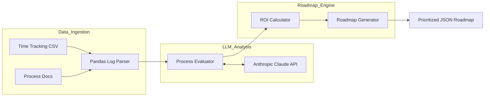

# Process Automation Finder

An AI-powered diagnostic tool that systematically analyzes operational workflows, identifies the highest-ROI automation candidates, and generates a prioritized engineering roadmap. 

Designed to replace "engineering instinct" with data-driven decision making, this tool ensures development teams focus on automations that deliver the maximum operational leverage.

---

## Technical Architecture

The system operates as a multi-stage pipeline, moving from raw CSV operational data to a scored, prioritized JSON roadmap.



---

## Core Components

### 1. Ingestion Pipeline (`src/ingestion/log_parser.py`)
Utilizes `pandas` to aggregate disparate operational time logs. It groups manual tasks by category and extracts the associated procedural documentation required for execution.

### 2. LLM Evaluator (`src/analyzer/llm_evaluator.py`)
Instead of relying on human scoping, this module passes the process descriptions to the Claude API. Using few-shot prompting, it assesses the cognitive complexity of the task (e.g., rule-based vs. nuanced negotiation) to assign a `feasibility_score` and an `estimated_build_hours` metric.

### 3. Prioritization Engine (`src/roadmap/generator.py`)
The engine's primary heuristic is **Time-Saved-Per-Build-Hour**. It algorithmically filters out low-feasibility processes and sorts the remainder strictly by ROI, guaranteeing that the highest-impact targets are surfaced first.

---

## Internal Validation Strategy

Before broader rollout, this tool was validated internally by running it against historical operational data. The tool's AI-generated roadmap correctly matched the top three automations the team had already built manually, proving its accuracy in surfacing high-ROI targets without human bias.

---

## Setup & Execution

### Installation
```bash
git clone https://github.com/manavanandani/ProcessAutomationFinder.git
cd ProcessAutomationFinder
pip install -r requirements.txt
```

### Running the Pipeline Demo
```bash
python3 main.py
```

---

## License
Copyright (c) 2026 Manav Anandani. Licensed under the MIT License.
